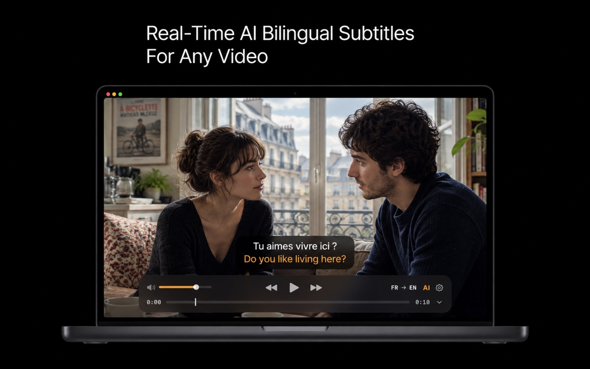

# KenjaPlayer

**Real-Time AI Bilingual Subtitles for Any Video — 100% on your device.**

iPhone · iPad · Mac · Apple TV

---

Watch any movie, show or lecture in any language. KenjaPlayer listens, transcribes and translates live into bilingual subtitles — entirely offline, on your device. And it's a first-class video player even with the AI switched off.

## Highlights

| | |
|---|---|
| 📝 **Real-time AI subtitles** | Live transcription + bilingual translation while you watch. 20+ recognition languages, 25+ translation targets. [→ Details](https://kenjaplayer.kofukuai.com/ai-subtitles.html) |
| ⚡ **AI video summaries** | Two-hour videos distilled into a clickable chapter timeline. Export as SRT or Markdown. Powered by Apple Intelligence. [→ Details](https://kenjaplayer.kofukuai.com/ai-summary.html) |
| 🎞 **100+ formats, 8K HDR** | MKV, RMVB, AVI, WMV, FLV, WebM and more — dual AVFoundation + libmpv engine, hardware accelerated. Nothing to convert. [→ Details](https://kenjaplayer.kofukuai.com/video-formats.html) |
| 🖥 **Your media, wherever it lives** | Jellyfin, Plex, Emby, SMB, WebDAV, FTP — direct connections, credentials never leave your device. [→ Details](https://kenjaplayer.kofukuai.com/media-servers.html) |
| 🔒 **Zero data collection** | No analytics, no ads, no accounts. Everything runs on-device. [Privacy policy](privacy.md) |

## Links

- 🌐 **Website** — <https://kenjaplayer.kofukuai.com>
- 📩 **Contact** — [kenjaplayer@kofukuai.com](mailto:kenjaplayer@kofukuai.com)

---

This repository hosts the KenjaPlayer website — a zero-dependency static site published via GitHub Pages. Site maintenance notes live in [MAINTENANCE.md](MAINTENANCE.md).
